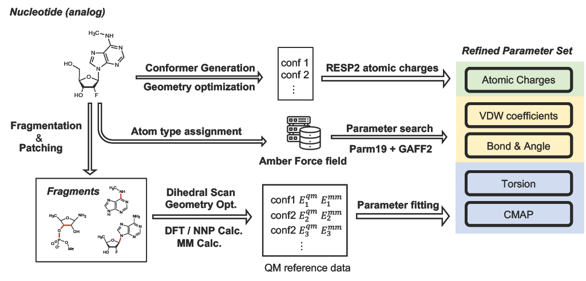
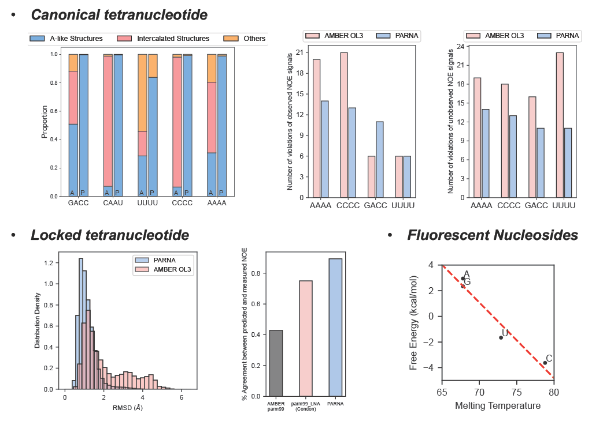

<a id="readme-top"></a>

<!-- [![Contributors][contributors-shield]][contributors-url]
[![Forks][forks-shield]][forks-url]
[![Stargazers][stars-shield]][stars-url]
[![Issues][issues-shield]][issues-url]
[![Unlicense License][license-shield]][license-url]
[![LinkedIn][linkedin-shield]][linkedin-url] -->

# PARNA


<!-- TABLE OF CONTENTS -->
<!-- <details>
  <summary>Table of Contents</summary>
  <ol>
    <li>
      <a href="#about-the-project">About The Project</a>
    </li>
    <li>
      <a href="#getting-started">Getting Started</a>
      <ul>
        <li><a href="#prerequisites">Prerequisites</a></li>
        <li><a href="#installation">Installation</a></li>
      </ul>
    </li>
    <li><a href="#usage">Usage</a></li>
    <li><a href="#roadmap">Roadmap</a></li>
    <li><a href="#contributing">Contributing</a></li>
    <li><a href="#license">License</a></li>
    <li><a href="#contact">Contact</a></li>
    <li><a href="#acknowledgments">Acknowledgments</a></li>
  </ol>
</details> -->


<!-- ABOUT THE PROJECT -->
## About The Project

PARNA is a parameterization workflow for nucleotides and their derivatives. It is premarily designed to parameterize the non-canonical nucleotides. Through the canonical nucleotides can be parameterized by `PARNA`, please also refer to more specifically optimized force fields if your system only involve canonical ribo-nucleotides. 

<p align="center">

</p>

<p align="right">(<a href="#readme-top">back to top</a>)</p>


<!-- GETTING STARTED -->
## Getting Started

### Installation
You can use the following command or just append the package path to the system `PATH` env.
```
python setup.pu install
```

<!-- USAGE EXAMPLES -->
## Usage

Refer to the [example](example) folder for detailed usage.

<p align="right">(<a href="#readme-top">back to top</a>)</p>

## Performance

<p align="center">

</p>

<!-- CONTACT -->
## Contact

Yanze Wang - yanze039@mit.edu

Project Link: [https://github.com/yanze039/parna](https://github.com/yanze039/parna)

For FEP/TI calculations, please also refer to the `amberti` wrapper.
[https://github.com/yanze039/amberti](https://github.com/yanze039/amberti)

<p align="right">(<a href="#readme-top">back to top</a>)</p>


<!-- ACKNOWLEDGMENTS -->
## Acknowledgments

`PARNA` is built on many excellent packages and insightful work.

### Packages and Softwares

* [RDKit](https://www.rdkit.org/)
* [ORCA](https://www.faccts.de/orca/)
* [Psi4](https://psicode.org/psi4manual/1.9.x/dft.html)
* [ParmEd](https://github.com/ParmEd/ParmEd)

### Insightful Work

`PARNA` has adopted or followed the following works. I highly recommend reading them to learn the development of RNA Class 1 force field.

> (1) Mlýnský, V.; Kührová, P.; Pykal, M.; Krepl, M.; Stadlbauer, P.; Otyepka, M.; Banáš, P.; Šponer, J. Can We Ever Develop an Ideal RNA Force Field? Lessons Learned from Simulations of the UUCG RNA Tetraloop and Other Systems. J. Chem. Theory Comput. 2025, acs.jctc.4c01357. https://doi.org/10.1021/acs.jctc.4c01357.

> (2) Anstine, D. M.; Zubatyuk, R.; Isayev, O. AIMNet2: A Neural Network Potential to Meet Your Neutral, Charged, Organic, and Elemental-Organic Needs. Chem. Sci. 2025, 16 (23), 10228–10244. https://doi.org/10.1039/D4SC08572H.

> (3) Chen, J.; Liu, H.; Cui, X.; Li, Z.; Chen, H.-F. RNA-Specific Force Field Optimization with CMAP and Reweighting. J. Chem. Inf. Model. 2022, 62 (2), 372–385. https://doi.org/10.1021/acs.jcim.1c01148.

> (4) Ivani, I.; Dans, P. D.; Noy, A.; Pérez, A.; Faustino, I.; Hospital, A.; Walther, J.; Andrio, P.; Goñi, R.; Balaceanu, A.; Portella, G.; Battistini, F.; Gelpí, J. L.; González, C.; Vendruscolo, M.; Laughton, C. A.; Harris, S. A.; Case, D. A.; Orozco, M. Parmbsc1: A Refined Force Field for DNA Simulations. Nat Methods 2016, 13 (1), 55–58. https://doi.org/10.1038/nmeth.3658.

There are also many amazing papers that inspired the development of `PARNA`. Please refer to the reference list in our manuscript. 

<p align="right">(<a href="#readme-top">back to top</a>)</p>

### More personal

Many thanks to Yingze Wang (UCB), Xinyan Wang (DPTechnology) and Weiliang Luo (MIT) for the discussion about technical details throughout the project. 

<!-- MARKDOWN LINKS & IMAGES -->
<!-- https://www.markdownguide.org/basic-syntax/#reference-style-links -->
<!-- [contributors-shield]: https://img.shields.io/github/contributors/othneildrew/Best-README-Template.svg?style=for-the-badge
[contributors-url]: https://github.com/othneildrew/Best-README-Template/graphs/contributors
[forks-shield]: https://img.shields.io/github/forks/othneildrew/Best-README-Template.svg?style=for-the-badge
[forks-url]: https://github.com/othneildrew/Best-README-Template/network/members
[stars-shield]: https://img.shields.io/github/stars/othneildrew/Best-README-Template.svg?style=for-the-badge
[stars-url]: https://github.com/othneildrew/Best-README-Template/stargazers
[issues-shield]: https://img.shields.io/github/issues/othneildrew/Best-README-Template.svg?style=for-the-badge
[issues-url]: https://github.com/othneildrew/Best-README-Template/issues
[license-shield]: https://img.shields.io/github/license/othneildrew/Best-README-Template.svg?style=for-the-badge
[license-url]: https://github.com/othneildrew/Best-README-Template/blob/master/LICENSE.txt
[linkedin-shield]: https://img.shields.io/badge/-LinkedIn-black.svg?style=for-the-badge&logo=linkedin&colorB=555
[linkedin-url]: https://linkedin.com/in/othneildrew
[product-screenshot]: images/screenshot.png
[Next.js]: https://img.shields.io/badge/next.js-000000?style=for-the-badge&logo=nextdotjs&logoColor=white
[Next-url]: https://nextjs.org/
[React.js]: https://img.shields.io/badge/React-20232A?style=for-the-badge&logo=react&logoColor=61DAFB
[React-url]: https://reactjs.org/
[Vue.js]: https://img.shields.io/badge/Vue.js-35495E?style=for-the-badge&logo=vuedotjs&logoColor=4FC08D
[Vue-url]: https://vuejs.org/
[Angular.io]: https://img.shields.io/badge/Angular-DD0031?style=for-the-badge&logo=angular&logoColor=white
[Angular-url]: https://angular.io/
[Svelte.dev]: https://img.shields.io/badge/Svelte-4A4A55?style=for-the-badge&logo=svelte&logoColor=FF3E00
[Svelte-url]: https://svelte.dev/
[Laravel.com]: https://img.shields.io/badge/Laravel-FF2D20?style=for-the-badge&logo=laravel&logoColor=white
[Laravel-url]: https://laravel.com
[Bootstrap.com]: https://img.shields.io/badge/Bootstrap-563D7C?style=for-the-badge&logo=bootstrap&logoColor=white
[Bootstrap-url]: https://getbootstrap.com
[JQuery.com]: https://img.shields.io/badge/jQuery-0769AD?style=for-the-badge&logo=jquery&logoColor=white
[JQuery-url]: https://jquery.com  -->
